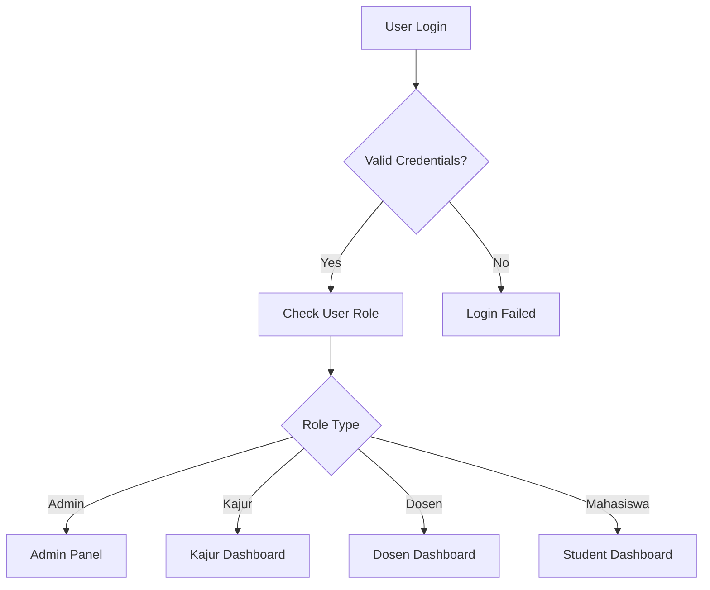

# 🎓 Sistem Pengajuan Judul Tugas Akhir

<div align="center">


**Sistem Informasi berbasis web untuk manajemen pengajuan judul Tugas Akhir mahasiswa**  
*Dibangun dengan TALL Stack (Tailwind, Alpine, Laravel, Livewire) dan Filament Admin Panel*

[🚀 Demo](#-demo) • [📋 Instalasi](#-instalasi--konfigurasi) • [📖 Dokumentasi](#-fitur-berdasarkan-role) • [🤝 Kontribusi](#-kontribusi)

</div>

---

## 📋 Daftar Isi

- [✨ Tentang Proyek](#-tentang-proyek)
- [🎯 Fitur Berdasarkan Role](#-fitur-berdasarkan-role)
- [🛠️ Teknologi TALL Stack](#️-teknologi-tall-stack)
- [📋 Prasyarat](#-prasyarat)
- [⚡ Instalasi & Konfigurasi](#-instalasi--konfigurasi)
- [👥 Setup User & Role](#-setup-user--role)
- [📁 Struktur Direktori](#-struktur-direktori-penting)
- [🔐 Autentikasi & Autorisasi](#-autentikasi--autorisasi)
- [📱 Screenshot](#-screenshot)
- [🚀 Deployment](#-deployment)
- [🤝 Kontribusi](#-kontribusi)
- [📄 Lisensi](#-lisensi)

---

## ✨ Tentang Proyek

Sistem Pengajuan Judul Tugas Akhir adalah aplikasi web modern yang dirancang untuk mempermudah proses manajemen pengajuan judul Tugas Akhir di perguruan tinggi. Sistem ini menyediakan workflow yang terstruktur mulai dari pengajuan judul oleh mahasiswa hingga persetujuan oleh Ketua Jurusan.

> 🎯 **Visi**: Digitalisasi proses akademik untuk meningkatkan efisiensi dan transparansi dalam pengelolaan Tugas Akhir mahasiswa.

### 🌟 **Keunggulan Utama**

- 🚀 **Modern Tech Stack**: Dibangun dengan TALL Stack terbaru
- 🎨 **UI/UX Responsif**: Tailwind CSS untuk tampilan yang modern
- ⚡ **Real-time Interaction**: Alpine.js dan Livewire untuk pengalaman pengguna yang smooth
- 🔐 **Multi-Role System**: 4 tingkat akses yang berbeda
- 📄 **PDF Generation**: Generate surat tugas otomatis
- 🎛️ **Admin Panel**: Filament untuk manajemen data yang powerful

---

## 🎯 Fitur Berdasarkan Role

<div align="center">

### 🧑‍🎓 **MAHASISWA**

</div>

<table>
<tr>
<td width="50%">

#### 🔐 **Autentikasi & Profil**
- ✅ Login & Register
- 👤 Manajemen profil
- 🔄 Update data pribadi

#### 📝 **Pengajuan Judul**
- ➕ Ajukan judul baru
- 📋 Tambah deskripsi lengkap
- 👨‍🏫 Pilih calon dosen pembimbing

</td>
<td width="50%">

#### 📊 **Dashboard & Monitoring**
- 📈 Status pengajuan real-time
- 📊 Progress tracking
- 🔔 Notifikasi update

#### 🔄 **Revisi & Bimbingan**
- 📝 Kelola revisi dari dosen
- 📅 Ajukan jadwal bimbingan
- 📄 Cetak surat tugas (PDF)

</td>
</tr>
</table>

---

<div align="center">

### 👨‍🏫 **DOSEN**

</div>

<table>
<tr>
<td width="50%">

#### 🎛️ **Dashboard Pembimbing**
- 👥 Daftar mahasiswa bimbingan
- 📊 Statistik bimbingan
- ⏰ Jadwal konsultasi

</td>
<td width="50%">

#### ✅ **Validasi & Feedback**
- ✅ Setujui/Tolak permohonan
- 📝 Berikan catatan revisi
- 📋 Evaluasi proposal

</td>
</tr>
</table>

---

<div align="center">

### 👔 **KETUA JURUSAN**

</div>

<table>
<tr>
<td width="50%">

#### 📊 **Dashboard Eksekutif**
- 📈 Overview semua pengajuan
- 📊 Laporan statistik
- 🎯 Key metrics

</td>
<td width="50%">

#### 🎯 **Validasi Final**
- ✅ Validasi judul TA
- 👨‍🏫 Tetapkan dosen pembimbing
- 📋 Persetujuan akhir

</td>
</tr>
</table>

---

<div align="center">

### ⚙️ **ADMIN**

</div>

<table>
<tr>
<td width="50%">

#### 🎛️ **Panel Administrasi**
- 🔧 Filament Admin Panel
- 👥 Manajemen semua user
- 🗃️ CRUD data master

</td>
<td width="50%">

#### 📊 **Sistem Management**
- 📈 Monitoring sistem
- 🔐 User access control
- 📋 Backup & maintenance

</td>
</tr>
</table>

---

## 🛠️ Teknologi TALL Stack

<div align="center">

| **Component** | **Technology** | **Version** | **Purpose** |
|:-------------:|:--------------:|:-----------:|:-----------:|
| 🎨 **T** | [Tailwind CSS](https://tailwindcss.com/) | 3.x | Utility-first CSS Framework |
| ⚡ **A** | [Alpine.js](https://alpinejs.dev/) | 3.x | Lightweight JavaScript Framework |
| 🔥 **L** | [Laravel](https://laravel.com/) | 10.x | PHP Web Application Framework |
| 🔄 **L** | [Livewire](https://laravel-livewire.com/) | 3.x | Dynamic Frontend Components |

</div>

### 🔧 **Additional Technologies**

- 🎛️ **Admin Panel**: [Filament 3](https://filamentphp.com/) - Modern admin interface
- 🔐 **Authentication**: [Laravel Breeze](https://laravel.com/docs/starter-kits#laravel-breeze) - Simple authentication scaffolding  
- 📄 **PDF Generation**: [DomPDF](https://github.com/barryvdh/laravel-dompdf) - PDF creation library
- 🗄️ **Database**: MySQL/MariaDB - Relational database management

---

## 📋 Prasyarat

Pastikan sistem Anda memenuhi requirements berikut:

<div align="center">

| **Software** | **Minimum Version** | **Recommended** | **Download Link** |
|:------------:|:------------------:|:---------------:|:-----------------:|
| 🐘 **PHP** | 8.1 | 8.2+ | [Download](https://php.net/downloads) |
| 🎼 **Composer** | 2.0 | Latest | [Download](https://getcomposer.org/download/) |
| 🟢 **Node.js** | 16.x | 18.x+ | [Download](https://nodejs.org/) |
| 📦 **NPM** | 8.x | Latest | Included with Node.js |
| 🗄️ **Database** | MySQL 8.0 | MySQL 8.0+ | [Download](https://dev.mysql.com/downloads/) |

</div>

### ✅ **System Requirements Check**

```bash
# Cek PHP version
php --version

# Cek Composer
composer --version

# Cek Node.js & NPM
node --version && npm --version

# Cek MySQL
mysql --version
```

---

## ⚡ Instalasi & Konfigurasi

### 🚀 **Quick Start Guide**

#### 1️⃣ **Clone Repository**

```bash
# Clone project
git clone https://github.com/sahrulraiya23/sistem-pengajuan-ta.git

# Navigate to directory
cd sistem-pengajuan-ta
```

#### 2️⃣ **Install Dependencies**

```bash
# Install PHP dependencies
composer install

# Install JavaScript dependencies  
npm install
```

<details>
<summary>🔍 <strong>View installed packages</strong></summary>

**PHP Packages:**
- `laravel/framework`
- `filament/filament`
- `livewire/livewire`
- `barryvdh/laravel-dompdf`
- `laravel/breeze`

**NPM Packages:**
- `tailwindcss`
- `alpinejs`
- `@tailwindcss/forms`
- `autoprefixer`

</details>

#### 3️⃣ **Environment Configuration**

```bash
# Copy environment file
cp .env.example .env

# Generate application key
php artisan key:generate
```

#### 4️⃣ **Database Setup**

Edit file `.env` dengan konfigurasi database Anda:

```env
# 🗄️ Database Configuration
DB_CONNECTION=mysql
DB_HOST=127.0.0.1
DB_PORT=3306
DB_DATABASE=sistem_pengajuan_ta
DB_USERNAME=your_db_username
DB_PASSWORD=your_db_password

# 📧 Mail Configuration (Optional)
MAIL_MAILER=smtp
MAIL_HOST=smtp.gmail.com
MAIL_PORT=587
MAIL_USERNAME=your_email@gmail.com
MAIL_PASSWORD=your_app_password
MAIL_ENCRYPTION=tls
```

#### 5️⃣ **Database Migration & Seeding**

```bash
# Run migrations
php artisan migrate

# (Optional) Run seeders for sample data
php artisan db:seed
```

> 💡 **Alternative**: Import `database/schema/mysql-schema.sql` directly to your database

#### 6️⃣ **Storage & Assets Setup**

```bash
# Create storage link
php artisan storage:link

# Build frontend assets
npm run dev

# For production
npm run build
```

#### 7️⃣ **Start Development Server**

```bash
# Start Laravel server
php artisan serve

# In another terminal, watch for changes
npm run dev
```

🎉 **Aplikasi berjalan di**: http://127.0.0.1:8000

---

## 👥 Setup User & Role

### 🔐 **Create Admin User**

```bash
# Create Filament admin user
php artisan make:filament-user
```

**Follow the prompts:**
```
Name: Admin User
Email: admin@example.com
Password: [your-secure-password]
```

### 🎭 **User Roles Available**

| Role | Access Level | Default Route | Permissions |
|------|--------------|---------------|-------------|
| 👑 **Admin** | Full System | `/admin` | All CRUD operations |
| 👔 **Kajur** | Department | `/kajur/dashboard` | Approve final submissions |
| 👨‍🏫 **Dosen** | Supervision | `/dosen/dashboard` | Guide students |
| 🧑‍🎓 **Mahasiswa** | Student | `/mahasiswa/dashboard` | Submit & track TA |

### 🔄 **Role Assignment**

Users can be assigned roles through:
1. 🎛️ **Filament Admin Panel** (`/admin`)
2. 🗄️ **Database Seeder**
3. 📝 **Manual Database Entry**

---

## 📁 Struktur Direktori Penting

```
sistem-pengajuan-ta/
├── 📱 app/
│   ├── 🎮 Http/
│   │   ├── Controllers/
│   │   │   ├── 🔐 Auth/           # Authentication controllers
│   │   │   ├── 👨‍🏫 Dosen/          # Lecturer controllers  
│   │   │   ├── 👔 Kajur/          # Department head controllers
│   │   │   └── 🧑‍🎓 Mahasiswa/     # Student controllers
│   │   └── 🛡️ Middleware/
│   │       └── CheckRole.php     # Role-based access control
│   ├── 📊 Models/                # Eloquent models
│   └── 🎛️ Providers/
│       └── Filament/            # Admin panel configuration
├── ⚙️ config/                    # Application configuration
├── 🗄️ database/
│   ├── 🏭 factories/             # Model factories
│   ├── 📋 migrations/            # Database migrations
│   ├── 📁 schema/                # SQL schema files
│   └── 🌱 seeders/               # Database seeders  
├── 🎨 resources/
│   ├── 🎨 css/                   # Stylesheets
│   ├── ⚡ js/                    # JavaScript files
│   └── 👁️ views/                 # Blade templates
│       ├── 🔐 auth/              # Authentication views
│       ├── 👨‍🏫 dosen/            # Lecturer views
│       ├── 👔 kajur/             # Department head views
│       └── 🧑‍🎓 mahasiswa/        # Student views
├── 🛣️ routes/
│   └── web.php                  # Web routes definition
└── 📋 ...
```

---

## 🔐 Autentikasi & Autorisasi

### 🔑 **Authentication Flow**



### 🛡️ **Role-Based Access Control**

The system uses Laravel's built-in authentication combined with custom role middleware:

```php
// CheckRole Middleware Example
Route::middleware(['auth', 'role:mahasiswa'])->group(function () {
    Route::get('/mahasiswa/dashboard', [MahasiswaController::class, 'dashboard']);
});
```

### 🎭 **Available Routes by Role**

<details>
<summary><strong>🧑‍🎓 Mahasiswa Routes</strong></summary>

```php
/mahasiswa/dashboard        # Dashboard
/mahasiswa/pengajuan        # Submit new TA title
/mahasiswa/revisi          # View revisions
/mahasiswa/bimbingan       # Request guidance
/mahasiswa/cetak-surat     # Print assignment letter
```

</details>

<details>
<summary><strong>👨‍🏫 Dosen Routes</strong></summary>

```php
/dosen/dashboard           # Dashboard
/dosen/persetujuan        # Approve/reject requests
/dosen/revisi             # Manage revisions
/dosen/mahasiswa          # View guided students
```

</details>

<details>
<summary><strong>👔 Kajur Routes</strong></summary>

```php
/kajur/dashboard          # Dashboard
/kajur/validasi           # Validate TA titles
/kajur/penentuan-dosen    # Assign supervisors
/kajur/laporan            # View reports
```

</details>

---

## 📱 Screenshot

<div align="center">

### 🏠 **Dashboard Overview**

| Role | Dashboard Preview |
|------|------------------|
| 🧑‍🎓 **Student** | *Clean interface for tracking TA progress* |
| 👨‍🏫 **Lecturer** | *Supervision management dashboard* |
| 👔 **Department Head** | *Executive overview with analytics* |
| ⚙️ **Admin** | *Comprehensive system management panel* |

*Screenshots will be added in future updates*

</div>

---

## 🚀 Deployment

### 🌐 **Production Deployment**

#### **Shared Hosting**

```bash
# Build for production
npm run build

# Optimize Laravel
php artisan config:cache
php artisan route:cache
php artisan view:cache

# Set proper permissions
chmod -R 755 storage bootstrap/cache
```

#### **VPS/Dedicated Server**

```bash
# Install dependencies
composer install --optimize-autoloader --no-dev

# Environment setup
php artisan key:generate
php artisan migrate --force

# Setup web server (Nginx/Apache)
# Configure SSL certificate
# Setup process manager (PM2/Supervisor)
```

### 🔧 **Environment Variables**

```env
# Production settings
APP_ENV=production
APP_DEBUG=false
APP_URL=https://yourdomain.com

# Database
DB_CONNECTION=mysql
DB_HOST=your-db-host
DB_DATABASE=your-db-name
DB_USERNAME=your-db-user
DB_PASSWORD=your-secure-password
```

---

## 🤝 Kontribusi

Kami sangat terbuka untuk kontribusi dari komunitas developer!

### 🌟 **Cara Berkontribusi**

1. 🍴 **Fork** repository ini
2. 🌿 **Buat branch** untuk fitur baru
   ```bash
   git checkout -b feature/amazing-feature
   ```
3. 💾 **Commit** perubahan Anda
   ```bash
   git commit -m "Add: amazing new feature"
   ```
4. 📤 **Push** ke branch
   ```bash
   git push origin feature/amazing-feature
   ```
5. 🔄 **Buat Pull Request**

### 🐛 **Bug Reports**

Gunakan [GitHub Issues](https://github.com/sahrulraiya23/sistem-pengajuan-ta/issues) dengan template:

```markdown
## 🐛 Bug Description
Brief description of the bug

## 🔄 Steps to Reproduce
1. Go to '...'
2. Click on '...'
3. See error

## ✅ Expected Behavior
What should happen

## 🖼️ Screenshots
If applicable, add screenshots

## 🖥️ Environment
- OS: [e.g. Windows 10]
- Browser: [e.g. Chrome 91]
- PHP Version: [e.g. 8.1]
```

### 💡 **Feature Requests**

We welcome feature suggestions! Please provide:
- 📋 **Use case description**
- 🎯 **Expected benefit**
- 🛠️ **Implementation suggestions**

---

## 📄 Lisensi

Proyek ini menggunakan **MIT License** - lihat file [LICENSE](LICENSE) untuk detail lengkap.

---

<div align="center">

### 🌟 **Jika proyek ini bermanfaat, berikan ⭐ di GitHub!**

**Dikembangkan dengan ❤️ oleh [Sahrul Raiya](https://github.com/sahrulraiya23)**

[🔗 Repository](https://github.com/sahrulraiya23/sistem-pengajuan-ta) • [📧 Contact](mailto:sahrulraiya23@example.com) • [💼 LinkedIn](https://linkedin.com/in/sahrulraiya23)

---

### 🤝 **Connect With Us**

[](https://github.com/sahrulraiya23)
[](https://linkedin.com/in/sahrulraiya23)
[](mailto:sahrulraiya23@example.com)

</div>

---

<div align="center">
<sub>© 2024 Sistem Pengajuan Judul TA. Built with TALL Stack ❤️</sub>
</div>